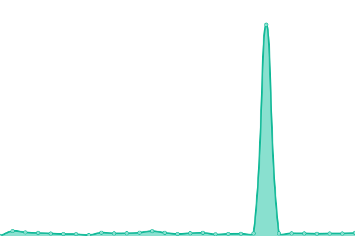

# [📈 Live Status](https://demo.upptime.js.org): <!--live status--> **🟧 Partial outage**

This repository contains the open-source uptime monitor and status page for [Suliman Sharif](https://demo.upptime.js.org), powered by [Upptime](https://github.com/upptime/upptime).

With [Upptime](https://upptime.js.org), you can get your own unlimited and free uptime monitor and status page, powered entirely by a GitHub repository. We use [Issues](https://github.com/Sulstice/uptime-zinc-db/issues) as incident reports, [Actions](https://github.com/Sulstice/uptime-zinc-db/actions) as uptime monitors, and [Pages](https://demo.upptime.js.org) for the status page.

<!--start: status pages-->
<!-- This summary is generated by Upptime (https://github.com/upptime/upptime) -->
<!-- Do not edit this manually, your changes will be overwritten -->
<!-- prettier-ignore -->
| URL | Status | History | Response Time | Uptime |
| --- | ------ | ------- | ------------- | ------ |
|  [Zinc 15](https://zinc15.docking.org) | 🟥 Down | [zinc-15.yml](https://github.com/Sulstice/uptime-zinc-db/commits/HEAD/history/zinc-15.yml) | 

 422ms
     
 | 

<a href="https://https://sulstice.github.io/uptime-zinc-db//history/zinc-15">84.71%</a>
    

|  [Zinc 20](https://zinc20.docking.org) | 🟩 Up | [zinc-20.yml](https://github.com/Sulstice/uptime-zinc-db/commits/HEAD/history/zinc-20.yml) | 

 441ms
     
 | 

<a href="https://https://sulstice.github.io/uptime-zinc-db//history/zinc-20">99.38%</a>
    

<!--end: status pages-->

[**Visit our status website →**](https://demo.upptime.js.org)

## 📄 License

- Powered by: [Upptime](https://github.com/upptime/upptime)
- Code: [MIT](./LICENSE) © [Suliman Sharif](https://demo.upptime.js.org)
- Data in the `./history` directory: [Open Database License](https://opendatacommons.org/licenses/odbl/1-0/)
