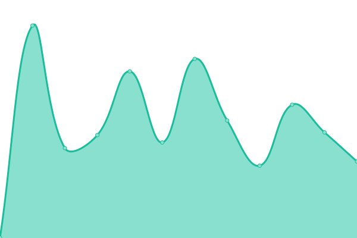
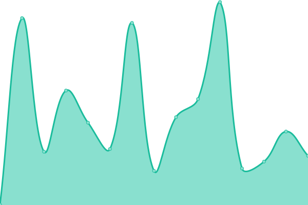
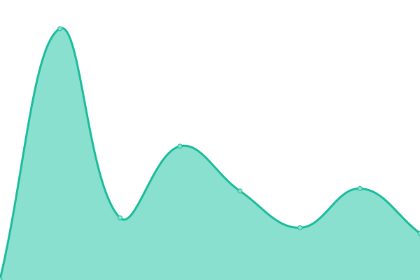
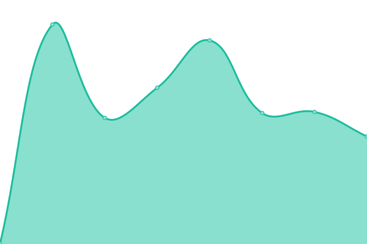

# [📈 Live Status](https://demo.upptime.js.org): <!--live status--> **🟧 Partial outage**

Hello and welcome to the Cheminformatic Status Database repository. As I explore chemical infinity online I often have misconnections or the resource is lost forever and also messes with my automation pipelines. In an attempt to keep track of the resources I use for myself I perform a heartbeat check to ensure they are still working. If you need it then just search the page and check the status. If the history is dead forever, links will be removed appropiately or into a deadlink category.

This repository contains the open-source uptime monitor and status page for [Suliman Sharif](https://demo.upptime.js.org), powered by [Upptime](https://github.com/upptime/upptime).

With [Upptime](https://upptime.js.org), you can get your own unlimited and free uptime monitor and status page, powered entirely by a GitHub repository. We use [Issues](https://github.com/Sulstice/uptime-zinc-db/issues) as incident reports, [Actions](https://github.com/Sulstice/uptime-zinc-db/actions) as uptime monitors, and [Pages](https://demo.upptime.js.org) for the status page.

<!--start: status pages-->
<!-- This summary is generated by Upptime (https://github.com/upptime/upptime) -->
<!-- Do not edit this manually, your changes will be overwritten -->
<!-- prettier-ignore -->
| URL | Status | History | Response Time | Uptime |
| --- | ------ | ------- | ------------- | ------ |
|  [Zinc 15](https://zinc15.docking.org) | 🟩 Up | [zinc-15.yml](https://github.com/Sulstice/Uptime-Cheminformatics/commits/HEAD/history/zinc-15.yml) | 

 2378ms
     
 | 

<a href="https://chemistrydb.com/history/zinc-15">85.44%</a>
    

|  [Zinc 20](https://zinc20.docking.org) | 🟩 Up | [zinc-20.yml](https://github.com/Sulstice/Uptime-Cheminformatics/commits/HEAD/history/zinc-20.yml) | 

 8065ms
     
 | 

<a href="https://chemistrydb.com/history/zinc-20">91.94%</a>
    

|  [PubChem](https://pubchem.ncbi.nlm.nih.gov) | 🟩 Up | [pub-chem.yml](https://github.com/Sulstice/Uptime-Cheminformatics/commits/HEAD/history/pub-chem.yml) | 

 308ms
     
 | 

<a href="https://chemistrydb.com/history/pub-chem">100.00%</a>
    

|  [NIST Chemistry Webhook](https://webbook.nist.gov/chemistry/) | 🟩 Up | [nist-chemistry-webhook.yml](https://github.com/Sulstice/Uptime-Cheminformatics/commits/HEAD/history/nist-chemistry-webhook.yml) | 

 292ms
     
 | 

<a href="https://chemistrydb.com/history/nist-chemistry-webhook">100.00%</a>
    

|  [Chem Exper](http://www.chemexper.com/) | 🟩 Up | [chem-exper.yml](https://github.com/Sulstice/Uptime-Cheminformatics/commits/HEAD/history/chem-exper.yml) | 

 2155ms
     
 | 

<a href="https://chemistrydb.com/history/chem-exper">87.24%</a>
    

|  [NMR Shift Database](https://nmrshiftdb.nmr.uni-koeln.de/) | 🟥 Down | [nmr-shift-database.yml](https://github.com/Sulstice/Uptime-Cheminformatics/commits/HEAD/history/nmr-shift-database.yml) | 

 0ms
     
 | 

<a href="https://chemistrydb.com/history/nmr-shift-database">0.00%</a>
    

|  [Drug Bank](https://go.drugbank.com/releases/latest) | 🟩 Up | [drug-bank.yml](https://github.com/Sulstice/Uptime-Cheminformatics/commits/HEAD/history/drug-bank.yml) | 

 457ms
     
 | 

<a href="https://chemistrydb.com/history/drug-bank">100.00%</a>
    

|  [Binding Database](http://www.bindingdb.org/bind/index.jsp) | 🟥 Down | [binding-database.yml](https://github.com/Sulstice/Uptime-Cheminformatics/commits/HEAD/history/binding-database.yml) | 

 613ms
     
 | 

<a href="https://chemistrydb.com/history/binding-database">0.00%</a>
    

|  [Spectral Database for Organic Compounds](https://sdbs.db.aist.go.jp/sdbs/cgi-bin/cre_index.cgi?lang=eng) | 🟩 Up | [spectral-database-for-organic-compounds.yml](https://github.com/Sulstice/Uptime-Cheminformatics/commits/HEAD/history/spectral-database-for-organic-compounds.yml) | 

 999ms
     
 | 

<a href="https://chemistrydb.com/history/spectral-database-for-organic-compounds">100.00%</a>
    

|  [Sider](http://sideeffects.embl.de/download/) | 🟩 Up | [sider.yml](https://github.com/Sulstice/Uptime-Cheminformatics/commits/HEAD/history/sider.yml) | 

 951ms
     
 | 

<a href="https://chemistrydb.com/history/sider">100.00%</a>
    

|  [ChemSpider](http://www.chemspider.com/Default.aspx) | 🟥 Down | [chem-spider.yml](https://github.com/Sulstice/Uptime-Cheminformatics/commits/HEAD/history/chem-spider.yml) | 

 523ms
     
 | 

<a href="https://chemistrydb.com/history/chem-spider">0.00%</a>
    

|  [Stitch](http://stitch.embl.de/cgi/download.pl) | 🟩 Up | [stitch.yml](https://github.com/Sulstice/Uptime-Cheminformatics/commits/HEAD/history/stitch.yml) | 

 1296ms
     
 | 

<a href="https://chemistrydb.com/history/stitch">100.00%</a>
    

|  [CardPred](http://bioanalysis.cau.ac.kr:7050/) | 🟩 Up | [card-pred.yml](https://github.com/Sulstice/Uptime-Cheminformatics/commits/HEAD/history/card-pred.yml) | 

 979ms
     
 | 

<a href="https://chemistrydb.com/history/card-pred">92.33%</a>
    

|  [Comparative Toxicogenomics Database](http://ctdbase.org/) | 🟩 Up | [comparative-toxicogenomics-database.yml](https://github.com/Sulstice/Uptime-Cheminformatics/commits/HEAD/history/comparative-toxicogenomics-database.yml) | 

 524ms
     
 | 

<a href="https://chemistrydb.com/history/comparative-toxicogenomics-database">95.20%</a>
    

|  [AMED Cardiotoxicity Database](https://drugdesign.riken.jp/hERGdb/) | 🟩 Up | [amed-cardiotoxicity-database.yml](https://github.com/Sulstice/Uptime-Cheminformatics/commits/HEAD/history/amed-cardiotoxicity-database.yml) | 

 1131ms
     
 | 

<a href="https://chemistrydb.com/history/amed-cardiotoxicity-database">100.00%</a>
    

|  [Tox21](https://tripod.nih.gov/tox21/challenge/data.jsp) | 🟩 Up | [tox21.yml](https://github.com/Sulstice/Uptime-Cheminformatics/commits/HEAD/history/tox21.yml) | 

 239ms
     
 | 

<a href="https://chemistrydb.com/history/tox21">77.95%</a>
    

|  [Drug Safety Analysis System](http://xundrug.cn/moltox) | 🟩 Up | [drug-safety-analysis-system.yml](https://github.com/Sulstice/Uptime-Cheminformatics/commits/HEAD/history/drug-safety-analysis-system.yml) | 

 882ms
     
 | 

<a href="https://chemistrydb.com/history/drug-safety-analysis-system">64.23%</a>
    

|  [OpenFDA](https://open.fda.gov/) | 🟩 Up | [open-fda.yml](https://github.com/Sulstice/Uptime-Cheminformatics/commits/HEAD/history/open-fda.yml) | 

 237ms
     
 | 

<a href="https://chemistrydb.com/history/open-fda">100.00%</a>
    

|  [Metabolites Biological Role](http://csbg.cnb.csic.es/mbrole2/) | 🟩 Up | [metabolites-biological-role.yml](https://github.com/Sulstice/Uptime-Cheminformatics/commits/HEAD/history/metabolites-biological-role.yml) | 

 611ms
     
 | 

<a href="https://chemistrydb.com/history/metabolites-biological-role">100.00%</a>
    

|  [MetaboAnalyst](https://www.metaboanalyst.ca/MetaboAnalyst/) | 🟩 Up | [metabo-analyst.yml](https://github.com/Sulstice/Uptime-Cheminformatics/commits/HEAD/history/metabo-analyst.yml) | 

 355ms
     
 | 

<a href="https://chemistrydb.com/history/metabo-analyst">100.00%</a>
    

|  [Adverse Drug Reaction Classification System](http://bioinf.xmu.edu.cn/ADReCS/) | 🟩 Up | [adverse-drug-reaction-classification-system.yml](https://github.com/Sulstice/Uptime-Cheminformatics/commits/HEAD/history/adverse-drug-reaction-classification-system.yml) | 

 1711ms
     
 | 

<a href="https://chemistrydb.com/history/adverse-drug-reaction-classification-system">99.67%</a>
    

|  [Metabolism and Transport Database](http://www-metrabase.ch.cam.ac.uk/) | 🟩 Up | [metabolism-and-transport-database.yml](https://github.com/Sulstice/Uptime-Cheminformatics/commits/HEAD/history/metabolism-and-transport-database.yml) | 

 955ms
     
 | 

<a href="https://chemistrydb.com/history/metabolism-and-transport-database">100.00%</a>
    

|  [Ecology Toxicity](https://cfpub.epa.gov/ecotox/) | 🟩 Up | [ecology-toxicity.yml](https://github.com/Sulstice/Uptime-Cheminformatics/commits/HEAD/history/ecology-toxicity.yml) | 

 275ms
     
 | 

<a href="https://chemistrydb.com/history/ecology-toxicity">100.00%</a>
    

|  [Human and Environment Risk Assessment](https://www.heraproject.com/RiskAssessment.cfm) | 🟩 Up | [human-and-environment-risk-assessment.yml](https://github.com/Sulstice/Uptime-Cheminformatics/commits/HEAD/history/human-and-environment-risk-assessment.yml) | 

 2553ms
     
 | 

<a href="https://chemistrydb.com/history/human-and-environment-risk-assessment">100.00%</a>
    

|  [International Toxicity Information for Risk Assesments](https://www.tera.org/iter/) | 🟩 Up | [international-toxicity-information-for-risk-assesments.yml](https://github.com/Sulstice/Uptime-Cheminformatics/commits/HEAD/history/international-toxicity-information-for-risk-assesments.yml) | 

 305ms
     
 | 

<a href="https://chemistrydb.com/history/international-toxicity-information-for-risk-assesments">100.00%</a>
    

|  [Japan Exisiting Database](https://dra4.nihs.go.jp/mhlw_data/jsp/SearchPageENG.jsp) | 🟩 Up | [japan-exisiting-database.yml](https://github.com/Sulstice/Uptime-Cheminformatics/commits/HEAD/history/japan-exisiting-database.yml) | 

 896ms
     
 | 

<a href="https://chemistrydb.com/history/japan-exisiting-database">100.00%</a>
    

|  [National Pesticide Center](http://npic.orst.edu/) | 🟩 Up | [national-pesticide-center.yml](https://github.com/Sulstice/Uptime-Cheminformatics/commits/HEAD/history/national-pesticide-center.yml) | 

 426ms
     
 | 

<a href="https://chemistrydb.com/history/national-pesticide-center">100.00%</a>
    

|  [Pesticide Info](https://www.pesticideinfo.org/) | 🟩 Up | [pesticide-info.yml](https://github.com/Sulstice/Uptime-Cheminformatics/commits/HEAD/history/pesticide-info.yml) | 

 615ms
     
 | 

<a href="https://chemistrydb.com/history/pesticide-info">100.00%</a>
    

|  [Kyoto Encyclopedia of Genes and Genomes](https://www.genome.jp/kegg/) | 🟩 Up | [kyoto-encyclopedia-of-genes-and-genomes.yml](https://github.com/Sulstice/Uptime-Cheminformatics/commits/HEAD/history/kyoto-encyclopedia-of-genes-and-genomes.yml) | 

 1132ms
     
 | 

<a href="https://chemistrydb.com/history/kyoto-encyclopedia-of-genes-and-genomes">100.00%</a>
    

|  [Hetereocycles](https://www.heterocycles.jp/newlibrary/natural_products/structure) | 🟥 Down | [hetereocycles.yml](https://github.com/Sulstice/Uptime-Cheminformatics/commits/HEAD/history/hetereocycles.yml) | 

 1505ms
     
 | 

<a href="https://chemistrydb.com/history/hetereocycles">0.00%</a>
    

|  [Chemical Resolver](https://cactus.nci.nih.gov/chemical/structure) | 🟩 Up | [chemical-resolver.yml](https://github.com/Sulstice/Uptime-Cheminformatics/commits/HEAD/history/chemical-resolver.yml) | 

 194ms
     
 | 

<a href="https://chemistrydb.com/history/chemical-resolver">100.00%</a>
    

|  [LookChem](https://www.lookchem.com/) | 🟩 Up | [look-chem.yml](https://github.com/Sulstice/Uptime-Cheminformatics/commits/HEAD/history/look-chem.yml) | 

 2679ms
     
 | 

<a href="https://chemistrydb.com/history/look-chem">100.00%</a>
    

|  [Lipid Maps](https://www.lipidmaps.org/) | 🟩 Up | [lipid-maps.yml](https://github.com/Sulstice/Uptime-Cheminformatics/commits/HEAD/history/lipid-maps.yml) | 

 1044ms
     
 | 

<a href="https://chemistrydb.com/history/lipid-maps">100.00%</a>
    

|  [IBM RXN For Chemistry](https://rxn.res.ibm.com/rxn/) | 🟩 Up | [ibm-rxn-for-chemistry.yml](https://github.com/Sulstice/Uptime-Cheminformatics/commits/HEAD/history/ibm-rxn-for-chemistry.yml) | 

 5735ms
     
 | 

<a href="https://chemistrydb.com/history/ibm-rxn-for-chemistry">100.00%</a>
    

<!--end: status pages-->

[**Visit our status website →**](https://demo.upptime.js.org)

## 📄 License

- Powered by: [Upptime](https://github.com/upptime/upptime)
- Code: [MIT](./LICENSE) © [Suliman Sharif](https://demo.upptime.js.org)
- Data in the `./history` directory: [Open Database License](https://opendatacommons.org/licenses/odbl/1-0/)
