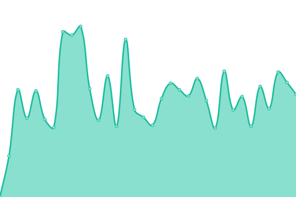

# [📈 Live Status](https://demo.upptime.js.org): <!--live status--> **🟩 All systems operational**

Hello and welcome to the Cheminformatic Status Database repository. As I access drug and chemical data online I often have misconnections or the resource is lost forever and also messes with my automation pipelines. In an attempt to keep track of the resources I use for myself I perform a heartbeat check to ensure they are still working.

This repository contains the open-source uptime monitor and status page for [Suliman Sharif](https://demo.upptime.js.org), powered by [Upptime](https://github.com/upptime/upptime).

With [Upptime](https://upptime.js.org), you can get your own unlimited and free uptime monitor and status page, powered entirely by a GitHub repository. We use [Issues](https://github.com/Sulstice/uptime-zinc-db/issues) as incident reports, [Actions](https://github.com/Sulstice/uptime-zinc-db/actions) as uptime monitors, and [Pages](https://demo.upptime.js.org) for the status page.

<!--start: status pages-->
<!-- This summary is generated by Upptime (https://github.com/upptime/upptime) -->
<!-- Do not edit this manually, your changes will be overwritten -->
<!-- prettier-ignore -->
| URL | Status | History | Response Time | Uptime |
| --- | ------ | ------- | ------------- | ------ |
|  [Zinc 15](https://zinc15.docking.org) | 🟩 Up | [zinc-15.yml](https://github.com/Sulstice/Uptime-Cheminformatics/commits/HEAD/history/zinc-15.yml) | 

 335ms
     
 | 

<a href="https://https://sulstice.github.io/uptime-zinc-db//history/zinc-15">100.00%</a>
    

|  [Zinc 20](https://zinc20.docking.org) | 🟩 Up | [zinc-20.yml](https://github.com/Sulstice/Uptime-Cheminformatics/commits/HEAD/history/zinc-20.yml) | 

 2059ms
     
 | 

<a href="https://https://sulstice.github.io/uptime-zinc-db//history/zinc-20">99.64%</a>
    

|  [PubChem](https://pubchem.ncbi.nlm.nih.gov) | 🟩 Up | [pub-chem.yml](https://github.com/Sulstice/Uptime-Cheminformatics/commits/HEAD/history/pub-chem.yml) | 

 3359ms
     
 | 

<a href="https://https://sulstice.github.io/uptime-zinc-db//history/pub-chem">100.00%</a>
    

|  [NIST Chemistry Webhook](https://webbook.nist.gov/chemistry/) | 🟩 Up | [nist-chemistry-webhook.yml](https://github.com/Sulstice/Uptime-Cheminformatics/commits/HEAD/history/nist-chemistry-webhook.yml) | 

 507ms
     
 | 

<a href="https://https://sulstice.github.io/uptime-zinc-db//history/nist-chemistry-webhook">100.00%</a>
    

|  [Chem Exper](http://www.chemexper.com/) | 🟩 Up | [chem-exper.yml](https://github.com/Sulstice/Uptime-Cheminformatics/commits/HEAD/history/chem-exper.yml) | 

 691ms
     
 | 

<a href="https://https://sulstice.github.io/uptime-zinc-db//history/chem-exper">100.00%</a>
    

|  [NMR Shift Database](https://nmrshiftdb.nmr.uni-koeln.de/) | 🟩 Up | [nmr-shift-database.yml](https://github.com/Sulstice/Uptime-Cheminformatics/commits/HEAD/history/nmr-shift-database.yml) | 

 994ms
     
 | 

<a href="https://https://sulstice.github.io/uptime-zinc-db//history/nmr-shift-database">100.00%</a>
    

|  [Drug Bank](https://go.drugbank.com/releases/latest) | 🟩 Up | [drug-bank.yml](https://github.com/Sulstice/Uptime-Cheminformatics/commits/HEAD/history/drug-bank.yml) | 

 334ms
     
 | 

<a href="https://https://sulstice.github.io/uptime-zinc-db//history/drug-bank">100.00%</a>
    

|  [Binding Database](http://www.bindingdb.org/bind/index.jsp) | 🟩 Up | [binding-database.yml](https://github.com/Sulstice/Uptime-Cheminformatics/commits/HEAD/history/binding-database.yml) | 

 182ms
     
 | 

<a href="https://https://sulstice.github.io/uptime-zinc-db//history/binding-database">100.00%</a>
    

|  [Spectral Database for Organic Compounds](https://sdbs.db.aist.go.jp/sdbs/cgi-bin/cre_index.cgi?lang=eng) | 🟩 Up | [spectral-database-for-organic-compounds.yml](https://github.com/Sulstice/Uptime-Cheminformatics/commits/HEAD/history/spectral-database-for-organic-compounds.yml) | 

 1439ms
     
 | 

<a href="https://https://sulstice.github.io/uptime-zinc-db//history/spectral-database-for-organic-compounds">100.00%</a>
    

|  [Sider](http://sideeffects.embl.de/download/) | 🟩 Up | [sider.yml](https://github.com/Sulstice/Uptime-Cheminformatics/commits/HEAD/history/sider.yml) | 

 896ms
     
 | 

<a href="https://https://sulstice.github.io/uptime-zinc-db//history/sider">100.00%</a>
    

|  [ChemSpider](http://www.chemspider.com/Default.aspx) | 🟩 Up | [chem-spider.yml](https://github.com/Sulstice/Uptime-Cheminformatics/commits/HEAD/history/chem-spider.yml) | 

 28459ms
     
 | 

<a href="https://https://sulstice.github.io/uptime-zinc-db//history/chem-spider">100.00%</a>
    

|  [Stitch](http://stitch.embl.de/cgi/download.pl) | 🟩 Up | [stitch.yml](https://github.com/Sulstice/Uptime-Cheminformatics/commits/HEAD/history/stitch.yml) | 

 1005ms
     
 | 

<a href="https://https://sulstice.github.io/uptime-zinc-db//history/stitch">100.00%</a>
    

<!--end: status pages-->

[**Visit our status website →**](https://demo.upptime.js.org)

## 📄 License

- Powered by: [Upptime](https://github.com/upptime/upptime)
- Code: [MIT](./LICENSE) © [Suliman Sharif](https://demo.upptime.js.org)
- Data in the `./history` directory: [Open Database License](https://opendatacommons.org/licenses/odbl/1-0/)
